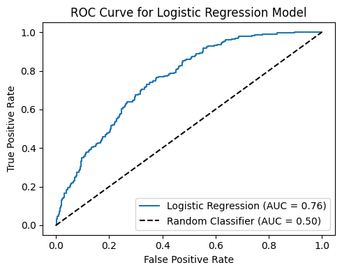
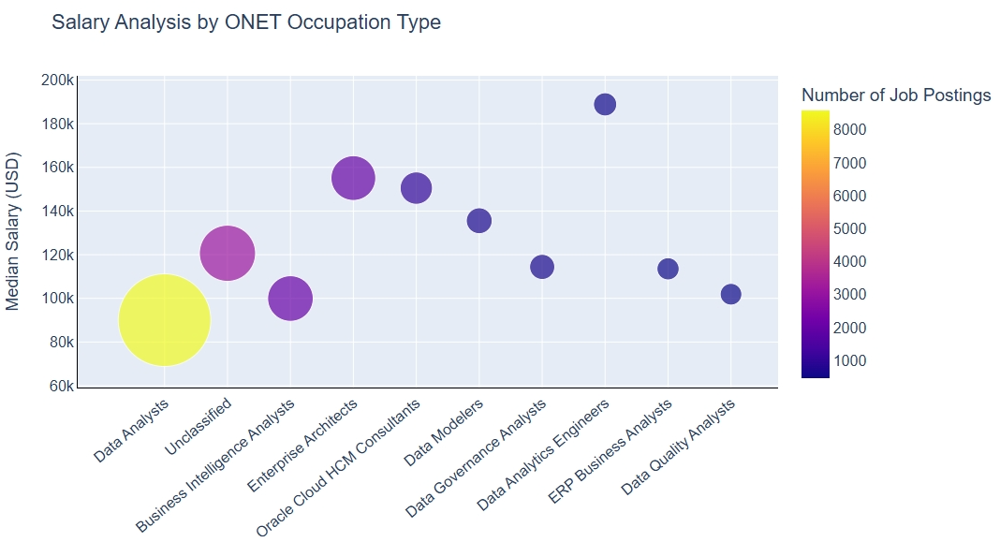
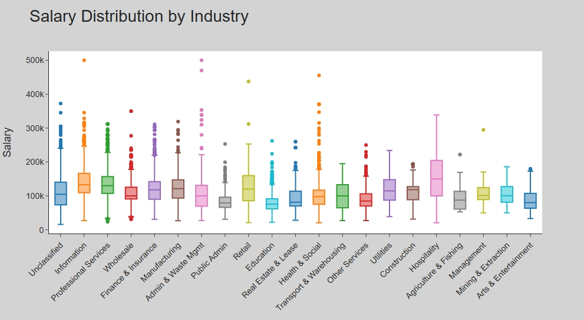
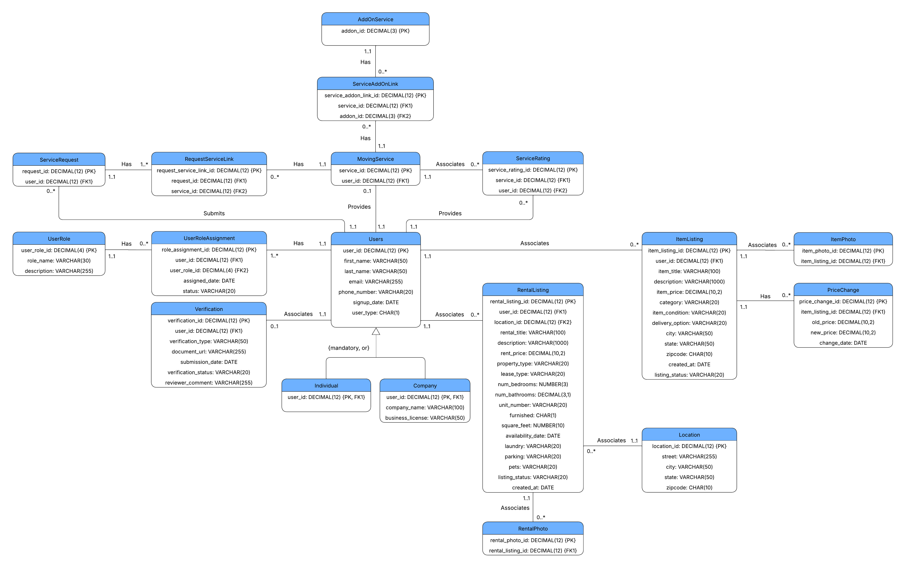

# About Me 
Hi, I’m Furong, a graduate student at Boston University specializing in **business analytics**. My work spans **simulation modeling**, **marketing and web analytics**, and real-world **data applications**. I’m passionate about transforming complex data into actionable insights and communicating findings through clear, impactful storytelling. Here you'll find my projects and some visual insights from my work.

# Projects
## Marketing Analytics
### 🦞 Lobsterland Consumer Insights
In this project, I analyzed customer behavior and sales trends to uncover seasonal patterns and channel effectiveness. Additionally, I built visualizations including time series analysis and heatmaps to support business decisions. These findings supported data-driven decisions in campaign targeting, inventory management, and operational planning.

- Language: Python
- Tools: Pandas, Seaborn

::: {.columns}

::: {.column width="50%"}
{width=100%}
:::

::: {.column width="50%"}
{width=100%}
:::

:::
[Read More](marketing_analytics.qmd){.btn .btn-outline-primary .btn-sm}

### 🔍 Cruise Booking Cancellation Analysis
In this project, I developed a classification model to identify passengers at risk of canceling their cruise bookings. Using customer demographic and behavioral data, I explored patterns in booking behavior and applied machine learning techniques to predict cancellation likelihood. Meanwhile, I evaluated model performance using appropriate metrics and interpreted key drivers of cancellation risk, uncovering actionable patterns among high-risk passenger segments. These insights enable targeted marketing strategies.

- Language: Python
- Tools: Pandas, Seaborn, Scikit-learn (Logistic Regression)

::: {.columns}

::: {.column width="50%"}
{width=100%}
:::

::: {.column width="50%"}
{width=100%}
:::

:::
[Read More](classification.qmd){.btn .btn-outline-primary .btn-sm}

## Web Analytics {#web-analytics}
### 💼 Job Postings Analytics Using Spark
The global job market is undergoing a profound transformation, driven by factors such as the rapid adoption of artificial intelligence (AI), evolving work models like remote work, and shifting wage structures across industries. In this project, me and my teammate analyzed global job market trends using PySpark, focusing on salary patterns across careers. The study explored the impact of remote work, regional differences, and industry-specific dynamics on compensation, providing actionable insights to support informed career planning and workforce strategy development.

- Language: Python
- Tools: Pandas, PySpark, Plotly

::: {.columns}

::: {.column width="50%"}
{width=100%}
:::

::: {.column width="50%"}
{width=100%}
:::

:::
[View Report](https://canva.link/6ejyh68s1c5h5uu){.btn .btn-outline-primary .btn-sm}

## Database design{#database-design}
### 💾 MoveMate: Integrated Relational Database for Relocation
Current relocation solutions are scattered across social media and informal channels, making informed decision-making difficult. In this project, I designed a relational database for "MoveMate," a one-stop platform that integrates rental housing management, moving services, and secondhand trading. I performed comprehensive requirement analysis to define entities including housing listings, service providers, and transaction histories. By establishing primary-foreign key relationships and data integrity constraints, I enabled cross-functional features such as personalized furniture recommendations. The resulting design provides a scalable foundation for managing distinct user roles and complex service interdependencies.

- Language: SQL
- Tools: Oracle, Lucidchart (ER Modeling)

{width=100% fig-align="center"}

# Other Projects{#other-projects}
- **[Data Visualization with Tableau](https://public.tableau.com/app/profile/furong.wang/viz/Dashboard_17439969338420/Dashboard1)**: Visitor trends and event impacts in Lobsterland Park.

- **[Business Analytics for Real Estate](https://canva.link/xth7j4rq1elcc5d)**: Delivered data-driven insights for the Eltingville real estate market by visualizing historical trends in **Power BI**. Leveraged **multiple regression** and **Excel Solver** to identify growth opportunities, predictive pricing, and optimized marketing strategies for enhanced business performance.

# Let's Connect
📧 **Email:** [frwang@bu.edu](mailto:frwang@bu.edu)  
🐙 **GitHub:** [github.com/frwang0919](https://github.com/frwang0919)  
📄 **My Work Experience:** [View My Resume (PDF)](pdf/Resume_Furong Wang_0326.pdf)
