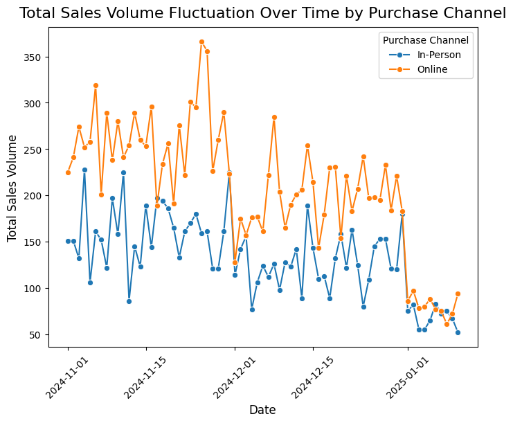
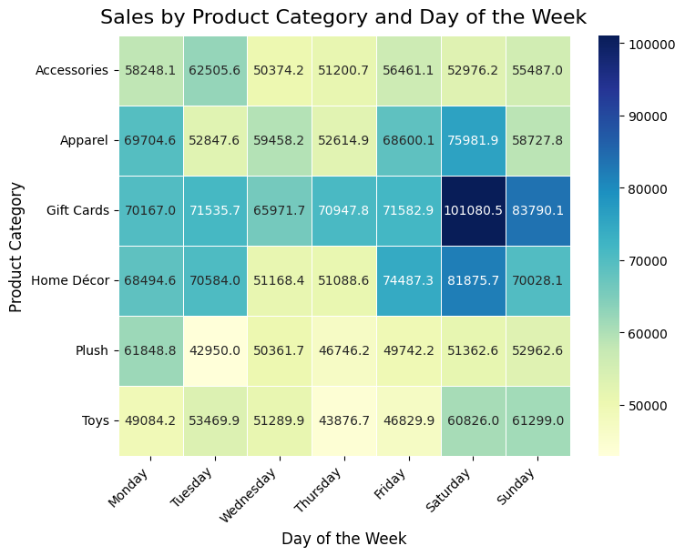
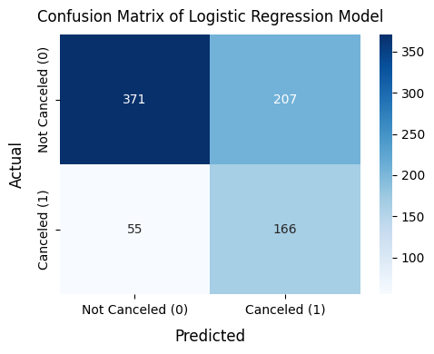
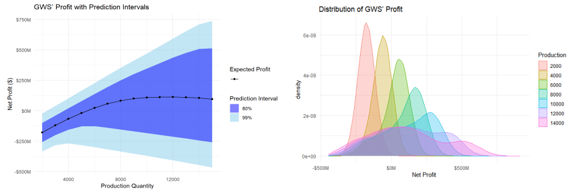

# About Me 
Hi, I’m Furong, a graduate student at Boston University specializing in **business analytics**. My work spans **simulation modeling**, **marketing and web analytics**, and real-world **data applications**. I’m passionate about transforming complex data into actionable insights and communicating findings through clear, impactful storytelling. Here you'll find my projects and some visual insights from my work.

# Projects
## Marketing Analytics
### 🦞 Lobsterland Consumer Insights
In this project, I analyzed customer behavior and sales trends to uncover seasonal patterns and channel effectiveness. Additionally, I built visualizations including time series analysis and heatmaps to support business decisions. These findings supported data-driven decisions in campaign targeting, inventory management, and operational planning.

- Language: Python
- Tools: Pandas, Seaborn

::: {.columns}

::: {.column width="50%"}
{width=100%}
:::

::: {.column width="50%"}
{width=100%}
:::

:::
[Read More](marketing_analytics.qmd){.btn .btn-primary}

### 🔍 Cruise Booking Cancellation Analysis
In this project, I developed a classification model to identify passengers at risk of canceling their cruise bookings. Using customer demographic and behavioral data, I explored patterns in booking behavior and applied machine learning techniques to predict cancellation likelihood. Meanwhile, I evaluated model performance using appropriate metrics and interpreted key drivers of cancellation risk, uncovering actionable patterns among high-risk passenger segments. These insights enable targeted marketing strategies.

- Language: Python
- Tools: Pandas, Seaborn, Scikit-learn (Logistic Regression)

{width=100% fig-align="center"}
[Read More](classification.qmd){.btn .btn-primary}

## Enterprise Risk Analytics
### 🔋 Monte Carlo Profit Simulation
Conducted Monte Carlo simulations to estimate profit outcomes for an electric motorboat startup. Visualized results with ribbon plots showing mean profit and 80%/99% prediction intervals, and density plots illustrating profit distributions across production levels.

- Language: R
- Tools: ggplot2, simulation modeling

{width=100% fig-align="center"}
[Read More](AD616.qmd){.btn .btn-primary}

## Web Analytics
### 💼 Job Postings Analytics Using Spark
The global job market is undergoing a profound transformation, driven by factors such as the rapid adoption of artificial intelligence (AI), evolving work models like remote work, and shifting wage structures across industries. In this project, I analyzed global job market trends using PySpark, focusing on salary patterns across careers. The study explored the impact of remote work, regional differences, and industry-specific dynamics on compensation, providing actionable insights to support informed career planning and workforce strategy development.

- Language: Python
- Tools: PySpark, 

[Read More](AD616.qmd){.btn .btn-primary}

## Database design

# Let's Connect
📧 **Email:** [frwang@bu.edu](mailto:frwang@bu.edu)  
🐙 **GitHub:** [github.com/frwang0919](https://github.com/frwang0919)  
📄 **My Work Experience:** [View My Resume (PDF)](pdf/Resume_Furong Wang_0326.pdf)
